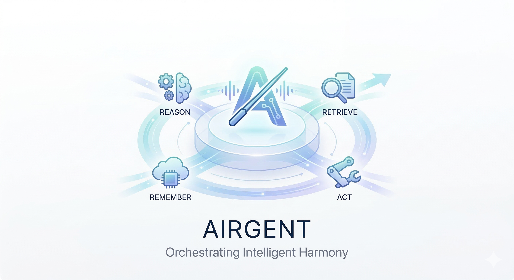

# Airgent



Airgent is a local-first agent base system. It exposes the same runtime through:

- a CLI
- an HTTP API
- a WebUI

The runtime uses the OpenAI Agents SDK for orchestration, keeps short-term conversation history in a local SQLite-backed session store, and persists long-term memory locally.

## Stack

- Python 3.11+
- `uv` for environment and command management
- FastAPI for API and static WebUI hosting
- Typer for CLI
- OpenAI Agents SDK for the agent runtime
- SQLite for sessions, transcripts, and memory

## Quick Start

```bash
uv sync
export OPENAI_API_KEY=your_key
export OPENAI_BASE_URL=https://xxx.example.com/v1
uv run airgent serve --reload
```

Then open `http://127.0.0.1:8000`.

## CLI

One-shot:

```bash
uv run airgent chat "给我一个今天的工作计划"
```

Interactive:

```bash
uv run airgent chat
```

TUI:

```bash
uv run airgent tui
```


Session inspection:

```bash
uv run airgent sessions list
uv run airgent sessions show <session-id>
```

Memory inspection:

```bash
uv run airgent memory list
uv run airgent memory search "uv python"
uv run airgent memory add "The user prefers uv for Python envs" --tags python,tooling
```

## API

Run the agent:

```bash
curl -X POST http://127.0.0.1:8000/api/v1/agent/run \
  -H 'Content-Type: application/json' \
  -d '{
    "input": "总结一下 Airgent 这个项目该怎么设计"
  }'
```

List sessions:

```bash
curl http://127.0.0.1:8000/api/v1/sessions
```

List memory:

```bash
curl http://127.0.0.1:8000/api/v1/memories
```

## Notes

- Local data defaults to `~/.airgent/airgent.db`.
- The default skill set includes a `context-builder` workflow for memory usage.
- `uv` is the intended workflow for dependency management and execution.
- `.env` is loaded automatically. These keys are supported:

```env
OPENAI_API_KEY=sk-...
OPENAI_BASE_URL=https://your-proxy.example.com/v1
OPENAI_API_MODE=chat_completions
```

- Airgent now configures the Agents SDK with an explicit `AsyncOpenAI` client, so proxy `base_url` settings are applied consistently for both CLI and API.
- `OPENAI_API_MODE` defaults to `chat_completions`, because proxy services are usually more compatible with that mode than `responses`.
- SDK tracing is disabled by default because this project persists conversations locally instead of relying on hosted tracing.

## license

MIT
